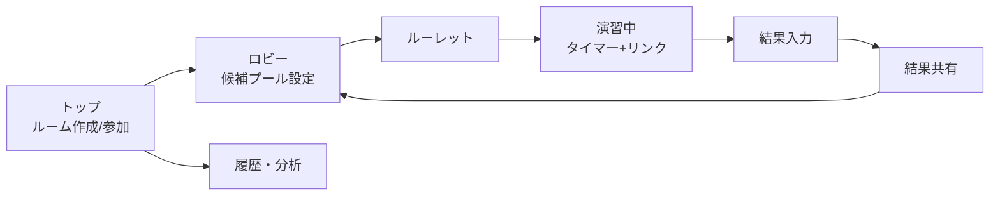

# 過去問ルーレット 仕様書

> この SPEC.md は Claude Docs の仕様書（`https://claude.ai/code/artifact/f7542510-d536-410d-98da-6199bb0634e5`）のミラー。
> 仕様の正は Docs 側。変更したら双方を合わせること。

## 概要・目的

通話中の友達と同じ画面でルーレットを回し、「大学 × 年度 × 科目」を1タップで決めて、そのまま時間計測・採点記録まで流せる Web アプリを作る。

- 解決したいこと: 今は決める→問題を探す→時間を測る→点数をメモ、がバラバラで手間が多い
- 最終目的: 京大工学部情報学科の本番形式（大問数・制限時間）に慣れる演習量を、遊び感覚を保ったまま増やす
- やらないこと: 問題PDFの保存・配布（入手元へのリンクだけ持つ。理由は「過去問の入手元と著作権の扱い」参照）

## 想定ユーザーと利用シーン

主な利用者は自分＋通話仲間の2〜4人。通話は Discord や LINE など既存アプリを使い、このアプリは通話機能を持たない。

1. ホストがルームを作り、招待リンクを通話チャットに貼る
2. 全員が参加したらホストがルーレットを回す（結果は全員の画面に同時に出る）
3. 出た大学・年度の問題を各自が入手元リンクから開き、共通タイマーで一斉に解く
4. 終了後、各自が点数と「落とした原因」を入力し、結果を見せ合う

想定端末: PC ブラウザ中心、スマホでも閲覧・入力できること。

## 機能要件

優先度は MVP（最初に作る）/ 次（2版目）/ 後（余裕があれば）の3段階。

| ID | 機能 | 内容 | 優先度 |
| --- | --- | --- | --- |
| F1 | ルーム | ホストが作成、招待リンクで参加、表示名だけで入れる（ログイン不要） | MVP |
| F2 | 候補プール設定 | 大学・科目・年度範囲（例: 2005〜2025）をチェックで選ぶ | MVP |
| F3 | ルーレット | 大学→年度（→大問）を順に回す。抽選はサーバー側で1回だけ行い全員に同じ結果を配信 | MVP |
| F4 | 重み付け | 大学ごとに出やすさを設定。既定は京大を最大、東大・阪大・東京科学大など同レベルを中、他を小 | MVP |
| F5 | 重複回避 | 自分（またはルーム全員）が解いた「大学×年度×科目」は候補から外す／出にくくする | MVP |
| F6 | 共通タイマー | 制限時間を大学×科目ごとにプリセット。開始・一時停止はホストが操作し全員同期 | MVP |
| F7 | 入手元リンク | 抽選結果に過去問の閲覧先URLを表示（東進DB、大学公式ページなど） | MVP |
| F8 | 結果入力 | 大問ごとの得点（自己採点）、所要時間、失点原因タグ（計算ミス／方針不明／時間切れ／知識不足） | MVP |
| F9 | 結果共有 | 終了後に全員の点数を並べて表示 | 次 |
| F10 | 履歴・分析 | 科目別の平均得点率、失点原因の割合、京大過去問の消化率 | 次 |
| F11 | 復習キュー | 失点した大問を「当日」「1週間後」に再出題リストへ自動追加 | 次 |
| F12 | 演出 | ルーレットのアニメーション・効果音 | 後 |

受験目的で外せない仕様が2つある。F4 の京大寄せ重み付けと、F11 の復習キュー。ルーレットの楽しさで量をこなしても、京大本番形式に偏らせ、間違えた問題に戻る仕組みがなければ点数に直結しない。

## 画面構成と画面遷移

画面は7つ。演習1回は「ロビー→ルーレット→演習中→結果入力→結果共有」で一周する。

- ロビー: 参加者一覧、候補プール（大学・科目・年度範囲）、重み、重複回避の ON/OFF
- ルーレット: 大学→年度の2段階で止まる。「振り直し」はホストのみ、1回まで
- 演習中: 残り時間を大きく表示、入手元リンク、途中離脱した人の表示
- 結果入力: 大問ごとの点数と失点原因タグ。未入力でも次に進める

## データモデル

問題そのものは持たず、「どの大学・年度・科目か」とそのメタ情報、演習結果だけを持つ。

| テーブル | 主な項目 | 備考 |
| --- | --- | --- |
| University | id, 名前, 既定の重み | 京大・東大・阪大・東京科学大などを初期登録 |
| ExamSet | id, 大学id, 学部, 年度, 課程(旧/新), 科目, 制限時間(分), 大問数, 各大問の配点, 出典URL, 入手元URL | 1セット＝1大学×1学部×1年度×1科目。配点は学部で違うため学部単位で持つ |
| Room | id, ホストid, 候補プール設定, 状態(待機/抽選済/演習中/終了) | 招待リンクは id から生成 |
| Member | id, ルームid, 表示名 | ログインなし。端末に匿名 id を保存 |
| Draw | id, ルームid, ExamSet id, 抽選日時, 振り直しフラグ | 抽選ログ。F5 の重複回避に使う |
| Result | id, Member id, Draw id, 大問ごとの得点, 所要時間, 失点原因タグ | 履歴・分析・復習キューの元 |
| ReviewItem | id, Member id, ExamSet id, 大問番号, 次回出題日 | F11用 |

ExamSet の集め方は次の「過去問データの集め方」に従う。

## 過去問データの集め方

難関国公立・有名私大の制限時間・大問数・配点は Web 上で見つかるので、Claude Code にウェブ検索で集めさせ、京大分だけ自分で公式資料と照合する。

1. 対象は約10大学に絞る（京大、東大、阪大、東京科学大、東北大、名大、九大、北大、早稲田、慶應）
2. 1件ごとに出典URLを必ず付けさせる。出典のない数字は入れない
3. 京大工学部の分は、京大公式の選抜要項・配点PDFと自分で照合する（本命の数字の誤りは許さない）
4. 他大学は予備校サイト等の二次情報でも可。気づいたズレはその都度直す

注意点:

- 京大は学部によって配点が大きく違う（[Z会](https://www.zkai.co.jp/kyodai-exam/kihon/)）。得点率の比較は学部の配点で行う
- 年度で変わる。新課程移行前の年度は「課程＝旧」として区別する
- 二次情報は公式とズレることがある。パスナビも最終確認は各大学の募集要項でと注記している（[パスナビ](https://passnavi.obunsha.co.jp/univ/0560/subject/?facultyID=045)）

## 技術構成と非機能要件

Web アプリ＋リアルタイム同期付きの BaaS で作る。インストール不要で、通話チャットにリンクを貼るだけで全員が入れるから。

- フロント: 既に慣れているフレームワーク（React等）で可。スマホ幅でも崩れないこと
- 同期: Firebase（Firestore）または Supabase（Realtime）のどちらか。ルーム状態・抽選結果・タイマーを全員に配信
- 抽選の公平性: 乱数はサーバー側（またはホスト端末で1回だけ）で決めて保存し、各端末は結果を受け取るだけ
- タイマー: 「開始時刻」と「一時停止中の累計」を共有し、各端末で残り時間を計算（端末ごとのズレ防止）
- 遅延: 抽選結果が全員に届くまで1秒以内を目安
- 同時利用: 1ルーム最大6人、同時ルーム数は数個で十分（無料枠内を想定）
- データ: 演習結果は消えないこと。ルームは24時間で自動終了

## 開発の進め方（Claude Code）

実装は GitHub につないだ Claude Code で行う。Web 版はリポジトリを隔離環境に複製して作業し、終わると新しいブランチに push するので、自分は PR を確認してマージするだけ（[Claude Help Center](https://support.claude.com/en/articles/12618689-claude-code-on-the-web)）。

1. この仕様書を Markdown にして、リポジトリに `SPEC.md` として置く
2. 「SPEC.md の MVP（F1〜F8）だけ作って」と範囲を絞って頼む
3. F1→F3→F6 の順に1機能ずつ作らせ、毎回動作確認してからマージ
4. デプロイは Vercel 等をリポジトリにつなぎ、main へのマージで自動デプロイ

GitHub 連携でも片付かない、自分でやる作業（合計30分程度）:

- [ ] Firebase または Supabase のプロジェクト作成とキー発行
- [ ] キーはデプロイ先の環境変数に入れる。リポジトリには絶対に書かない（コードは `.env` 参照にさせる）
- [ ] 京大工学部の ExamSet を公式資料と照合

開発に使うのは週末1〜2日まで。未決事項を先に決めてから渡す（曖昧なまま渡すと作り直しになる）。

## 過去問の入手元と著作権の扱い

アプリは問題PDFを保存・再配布せず、入手元へのリンクだけを表示する。

| 入手元 | 内容 | 条件 |
| --- | --- | --- |
| [東進 大学入試問題過去問データベース](https://www.toshin-kakomon.com/) | 共通テストと東大・京大など主要国公立の二次、難関私大の問題と解答 | 東進WEB会員の無料登録が必要 |
| [京都大学 一般選抜の試験問題等](https://www.kyoto-u.ac.jp/ja/admissions/undergrad/past-eq) | 京大公式の試験問題と出題意図 | 登録不要 |
| [旺文社 パスナビ（京大）](https://passnavi.obunsha.co.jp/univ/0560/kakomon/) | 解答・解説付きの過去問 | 旺文社まなびIDの無料登録が必要、一部有料 |
| 赤本（教学社） | 解説付き、手元で解く用 | 購入 |

リンク方式にする理由: 京大の公式ページは、掲載した問題の複製や利用には著作権者の権利を侵さないこと、場合によっては著作権者の許諾が必要なことを明記している（[出典](https://www.kyoto-u.ac.jp/ja/admissions/undergrad/past-eq/r7-eq)）。東進DBは会員登録制なので、各自がログインして開く前提にする。

解答・解説の質は入手元でばらつくので、ExamSet に「解説の有無」を持たせ、京大の問題は赤本やパスナビで復習する運用にする。

## MVPとロードマップ、未決事項

MVP は週末1〜2日で作れる範囲に絞る。開発が勉強時間を食い始めたら負け。

- [ ] MVP: F1〜F8（ルーム、抽選、京大寄せ重み、重複回避、タイマー、リンク、結果入力）
- [ ] 2版目: F9〜F11（結果共有、履歴・分析、復習キュー）
- [ ] 後回し: F12（演出）

決定事項（もとの未決事項）:

- [x] **対象科目**: ExamSet は科目単位で持ち、1回の演習は1科目。候補プールには複数科目を入れられるが、抽選で1科目に決まる。京大の理科は物理・化学で180分だが、1科目=90分として分けて持つ
- [x] **抽選の粒度**: 「1年度まるごと」と「大問1問だけ」をロビーで切り替える（F3の3段目は入れる）
- [x] **重み**: ルーム共通。ホストが設定する。個人ごとにすると共通タイマーと結果共有が成立しないため
- [x] **旧課程の制限時間**: ExamSet がその年度当時の制限時間を持つので、当時基準で測る。京大数学は6問150分で変わっていないので実質影響はない
- [x] **同期バックエンド**: Supabase（Postgres + Realtime）。ExamSet の絞り込みと F10 の分析クエリが SQL で書けるため

## Sources

- [東進 大学入試問題過去問データベース](https://www.toshin-kakomon.com/)
- [京都大学 一般選抜の試験問題等](https://www.kyoto-u.ac.jp/ja/admissions/undergrad/past-eq)
- [京都大学 令和7年度 試験問題および出題意図等](https://www.kyoto-u.ac.jp/ja/admissions/undergrad/past-eq/r7-eq)
- [京都大学 令和7年度 入学者選抜要項](https://www.kyoto-u.ac.jp/sites/default/files/inline-files/ippansenbatsuyokoR7_all-b926c21dc22d09fa98d2a8ae21a8ebee.pdf)
- [旺文社 パスナビ 京都大学の過去問](https://passnavi.obunsha.co.jp/univ/0560/kakomon/)
- [旺文社 パスナビ 京都大学工学部 入試科目](https://passnavi.obunsha.co.jp/univ/0560/subject/?facultyID=045)
- [Z会 京大入試の学部別基本情報](https://www.zkai.co.jp/kyodai-exam/kihon/)
- [Claude Code on the web（Claude Help Center）](https://support.claude.com/en/articles/12618689-claude-code-on-the-web)
